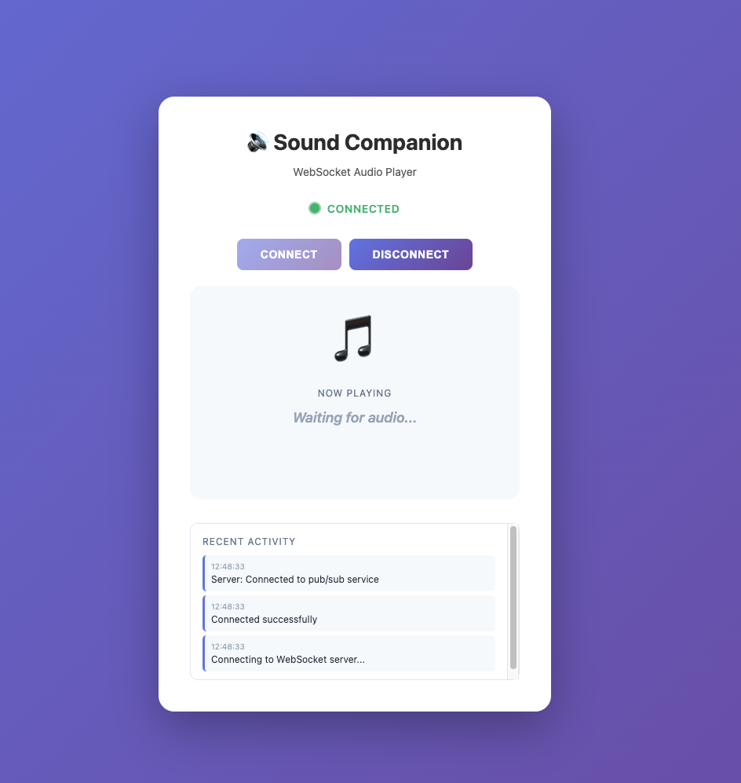
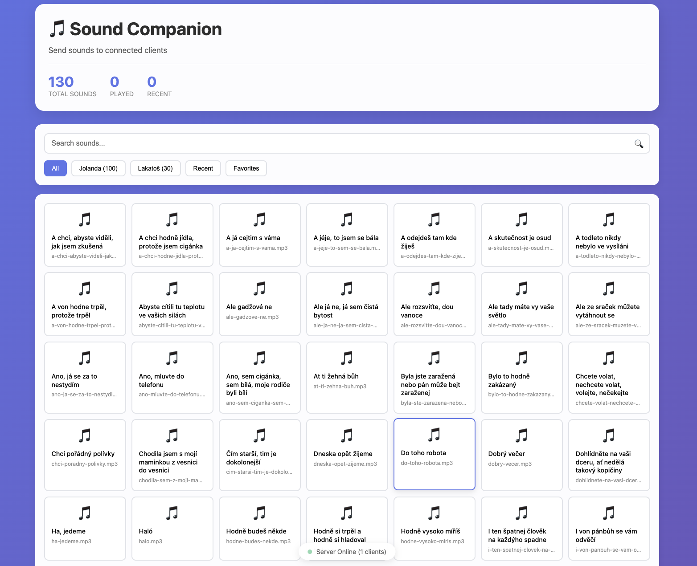

# 🔊 Sound Companion

## Because Sometimes Your Office Needs a Soundtrack

Ever wanted to trigger an impeccably timed sound effect to match whatever chaos is unfolding in your office? No? Well, welcome anyway. Sound Companion is the tiny, opinionated system that turns awkward silences, failed presentations, and questionable management decisions into full-bodied multimedia experiences.

### What Does It Do?

Sound Companion lets you remotely control audio playback across office machines with surgical precision. Want a victory horn when someone fixes that bug from 2019? Want a dramatic sting during another meeting that could have been an email? Sound Companion has your back.

### The Magic of Vibe Coding

A little vibe coding, a tiny runtime, and one clean deployment pipeline are all it takes to move an idea from sketch to production. Combine:
- 🎵 Thoughtfully timed audio
- 💻 Minimal, focused engineering
- ☁️ rock8.cloud for fast deployment

…and you get a tool that transforms the office mood with very little overhead.

### Rock8.Cloud Deployment

From prototype to production in minutes. Push, deploy, and enjoy the awkwardness you just made possible. The stack is container-friendly and ready for the cloud.

## Getting Started

### Installation

```bash
bun install
```

### Development

```bash
bun dev
```

This starts a development server on **port 3700**.

### Production

```bash
bun start
```

### Docker

```bash
docker build -t sound-companion .
docker run -p 3700:3700 sound-companion
```

## How It Works

- **WebSocket** — low-latency broadcasts to connected clients
- **REST API** — simple endpoints for integrations
- **Multiple Sound Boards** — curated sound sets (see `jolanda-definition.ts`, `lakatos-definition.ts`)
- **Static File Serving** — client UI served from `/public`

## 🎧 Distributed Audio

A neat side effect: when many listener clients connect to the same sender, you get a distributed audio setup where all connected laptops play the same audio. In plain terms:

- One sender/control panel broadcasts audio commands.
- Many listener clients (laptops, desktops) receive those commands and play audio locally.
- The result is an office-wide, multi-device soundscape — effectively using everyone’s laptops as a combined speaker system.

Why this is cool:
- You can create synchronized reactions and immersive audio moments across the room without any extra configuration.
- It’s simple — just open the sender on one machine and listeners on others; they all connect to the same WebSocket server.
- It supports scenarios from lighthearted pranks to coordinated alerts.

How to set it up:
1. Open the Sender Dashboard: `/public/sender.html`
2. Open the Listener Client on each laptop: `/public/websocket-client.html`
3. All clients connect to the WebSocket endpoint (e.g., `ws://your-server:3700/ws`)
4. Trigger a sound from the sender — all connected listeners play it

Notes:
- WebSocket timing is good but not guaranteed to be sample-perfect across many devices; results are impressive for office use, but don't expect studio-grade sync.
- Network latency and client audio buffer behavior will affect perceived synchronization.

## 📸 Screenshots (using local images)

### Listener Client — The Receiver
*Route: `/public/websocket-client.html`*



This is the minimal listener UI that people open on their laptops. It shows connection status, the current "now playing" card, and a realtime activity log so you can see when sounds were triggered.

Key bits:
- Connection indicator (CONNECTED / DISCONNECTED)
- Now playing area with artwork/placeholder
- Activity log with timestamps
- Connect / Disconnect controls

### Sender Dashboard — The Control Center
*Route: `/public/sender.html`*



This is your control panel: a searchable library of sounds, category filters, usage stats, and a single click to broadcast audio to every connected listener.

Key bits:
- Sound library with categories (e.g., Jolanda, Lakatoš)
- Search and filters (All / Recent / Favorites)
- Statistics (total sounds, played, recent)
- Server status and connected clients indicator
- Click-to-broadcast workflow — hits all connected listeners

### Multi-Client Stereo Setup (Illustration)

One sender broadcasts a message; multiple listener clients play it:

```
Sender Dashboard (/public/sender.html)
      │
      ├─ WebSocket broadcast ───────────────────────────────┐
      │                                                     │
┌─────▼────┐  ┌─────▼────┐  ┌─────▼────┐  ┌─────▼────┐  ┌─────▼────┐
│Laptop 1  │  │Laptop 2  │  │Laptop 3  │  │Laptop 4  │  │Laptop N  │
│listener  │  │listener  │  │listener  │  │listener  │  │listener  │
│speaker   │  │speaker   │  │speaker   │  │speaker   │  │speaker   │
└──────────┘  └──────────┘  └──────────┘  └──────────┘  └──────────┘

= Synchronized office-wide playback (dependent on network & client buffers)
```

## Tech Stack

- **Elysia** — minimal server framework for Bun
- **Bun** — fast runtime for JS/TS
- **TypeScript** — type safety
- **[rock8.cloud](https://rock8.cloud/)** — quick, reliable deployment

## Acknowledgments

Inspired by and built with gratitude to **[soundboardio](https://github.com/soundboardio/)**. Their project helped shape the idea — thanks!

---

*Use responsibly. Or don't. We won't stop you.*
